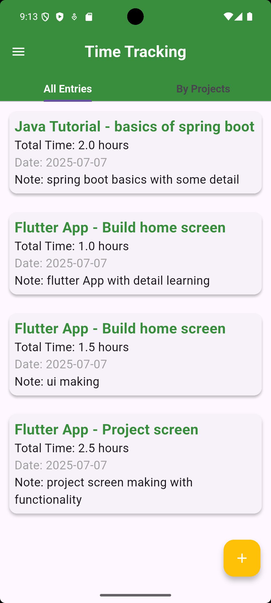
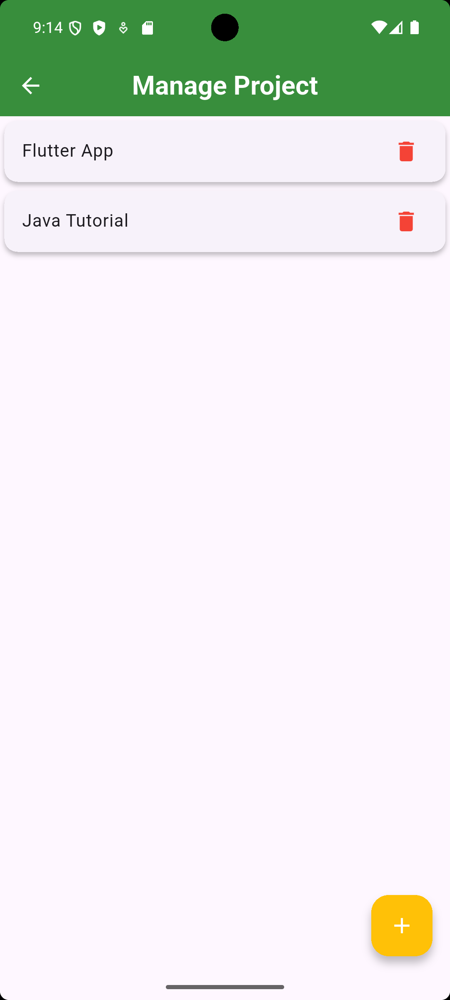
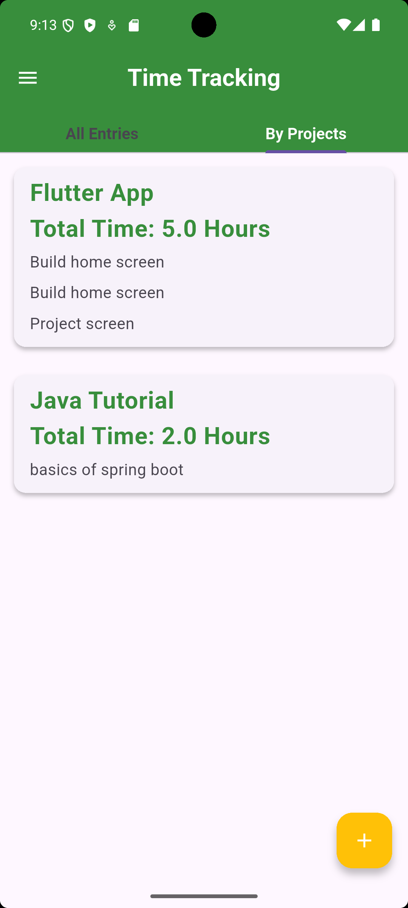

# 🕒 Time Tracker App

A **Flutter-based time management app** that helps you track time spent on your **projects and tasks** — perfect for freelancers, developers, and anyone who wants to improve productivity.

---

## 📱 Features

✅ **Time Entry Management**  
- Add new time entries  
- Edit existing entries  
- Delete time entries  

✅ **Project & Task Management**  
- Add and delete projects  
- Add and delete tasks  
- View time entries grouped by project  
- See total time calculated per task under each project

✅ **Time Entry Views**  
- View all time entries  
- View time entries by project with summaries

✅ **User Experience Enhancements**  
- Beautiful and responsive UI  
- Slide-to-delete using `flutter_slidable`  
- Dialog-based input for intuitive interaction

✅ **Data Persistence**  
- All data is stored locally on the device using `localstorage`  
- No internet connection required

---

## 📸 Screenshots

|      Home Screen      | Manage Projects | Project Time Consumption |
|-----------------------|-------------------|----------------------------|
|  |  |  |

---
---

## 📂 Project Structure
```
lib/
├── model/
│   ├── time_entry.dart
│   ├── task.dart
│   └── project.dart
├── provider/
│   ├── project_provider.dart
│   ├── task_provider.dart
│   └── time_provider.dart
├── screens/
│   ├── home_screen.dart
│   ├── add_time.dart
│   ├── all_entries.dart
│   ├── group_projects.dart
│   ├── manage_projects.dart
│   └──  manage_tasks.dart.dart
├── utils/
│   └── widgets/
│       ├── custom_text_widget.dart
└── main.dart
```

## 🚀 Getting Started

1. **Clone the repository:**
   ```bash
   git clone https://github.com/UmarOnTheGo/time-tracker.git
   cd time-tracker
   ```
   
2. **Install the dependencies:**
  ```bash
  flutter pub get
  ```

3. **Run:**
```bash
  flutter run
```

4. **To build a release version of your app for Android:**
   ``` bash
   flutter build apk --release
   ```
The apk will be located at 
  ```
  build/app/outputs/flutter-apk/app-release.apk
```
